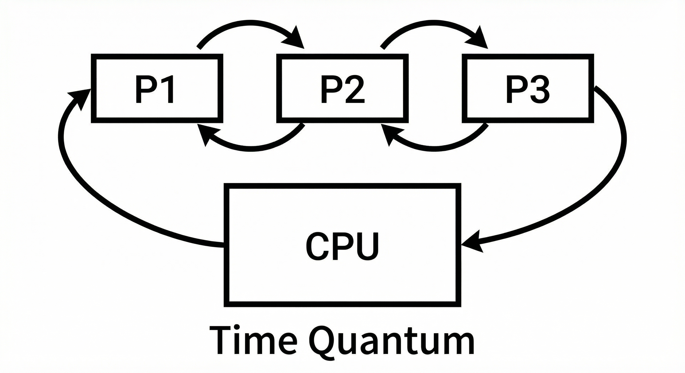
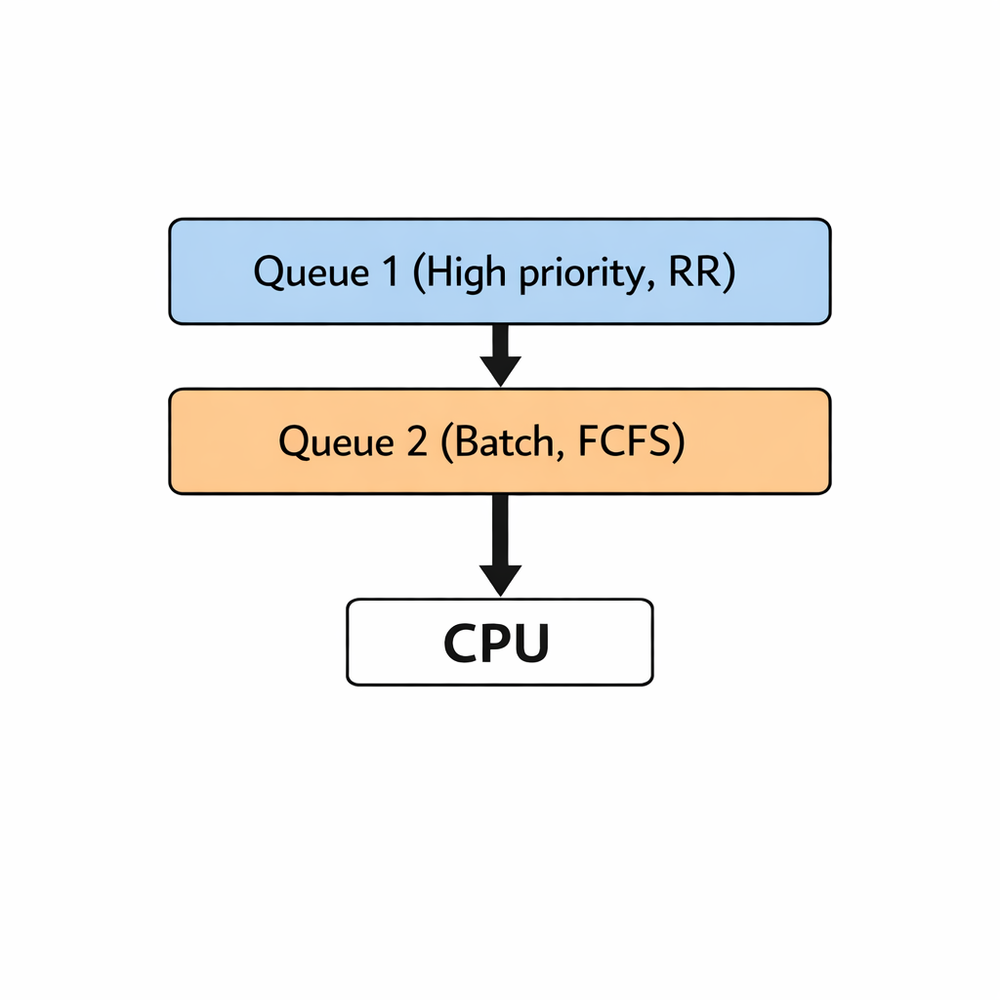

# 운영체제 OS

## CPU 스케줄링 알고리즘

정보처리기사 실기 핵심 — **선점형**과 **비선점형** 스케줄링을 구분하고, 각 알고리즘의 특징을 정리합니다.

---

### 1. 선점 vs 비선점

| 구분 | 비선점 (Non-Preemptive) | 선점 (Preemptive) |
|------|-------------------------|-------------------|
| **의미** | 프로세스가 CPU를 잡으면 스스로 반납할 때까지 계속 실행 | 운영체제가 중간에 CPU를 빼앗을 수 있음 |
| **문맥 교환** | 적음 | 많음 (오버헤드 있음) |
| **대표 알고리즘** | FCFS, SJF, HRN | RR, SRT, MLQ, MLFQ |

---

### 2. 비선점 스케줄링 알고리즘

#### 2.1 FCFS (First Come First Served)

**선입선출.** 도착 순서대로 CPU를 할당한다.

- **특징**: 가장 단순. 큐(Queue)로 구현.
- **장점**: 공정하고 구현이 쉽다.
- **단점**: Convoy 효과(긴 작업 하나가 뒤를 모두 대기시킴), 평균 대기 시간이 길어질 수 있다.

```
예: 도착 순서 P1(24) → P2(3) → P3(3)
    실행: P1 24ms → P2 3ms → P3 3ms
    P2, P3는 P1 끝날 때까지 대기
```

---

#### 2.2 SJF (Shortest Job First)

**가장 짧은 작업을 먼저** 실행한다.

- **특징**: 비선점이면 “실행 시간이 짧은 순”으로 선택.
- **장점**: 평균 대기 시간을 줄이기 좋다.
- **단점**: 긴 작업은 기아(Starvation) 가능. 실행 시간을 미리 알아야 해서 예측이 필요하다.

```
예: P1(6), P2(8), P3(7), P4(3) → 실행 순서: P4(3) → P1(6) → P3(7) → P2(8)
```

---

#### 2.3 HRN (Highest Response ratio Next)

**응답률이 가장 높은 프로세스**를 다음에 실행한다.

- **응답률 공식**:
  `응답률 = (대기시간 + 서비스시간) / 서비스시간`
- **특징**: SJF의 기아를 완화. 오래 기다린 작업일수록 응답률이 올라가서 기회를 받는다.
- **장점**: 대기 시간과 서비스 시간을 함께 고려해 공정성과 효율의 균형.
- **단점**: 매번 응답률을 계산해야 한다.

```
예: 서비스시간 4인 작업이 6만큼 대기 → 응답률 = (6+4)/4 = 2.5
```

---

### 3. 선점 스케줄링 알고리즘

#### 3.1 RR (Round Robin)

**시간 할당량(Time Quantum)**만큼만 실행하고, 끝나지 않으면 **큐의 맨 뒤로** 보낸다.

- **특징**: 시분할 시스템의 기본. 모든 프로세스에 시간을 균등하게 나눠 준다.
- **장점**: 응답 시간이 좋고, 공정하다.
- **단점**: 할당량이 너무 크면 FCFS처럼 되고, 너무 작으면 문맥 교환 오버헤드가 커진다.



---

#### 3.2 SRT (Shortest Remaining Time)

**남은 실행 시간이 가장 짧은 프로세스**를 선점하여 실행한다. **선점형 SJF**라고 보면 된다.

- **특징**: 새 프로세스 도착 시, 현재 실행 중인 프로세스의 남은 시간보다 새 프로세스의 실행 시간이 더 짧으면 **선점**.
- **장점**: SJF보다 평균 대기·회전 시간을 더 줄일 수 있다.
- **단점**: 남은 시간 예측 필요, 긴 작업은 기아 가능.

```
예: P1(8) 실행 중, P2(4) 도착 → P1 남은 8 > P2의 4 → P2 선점 실행
```

---

#### 3.3 MLQ (Multi-Level Queue)

**여러 개의 큐**를 두고, 프로세스 **유형별로 큐를 나누어** 각 큐마다 다른 스케줄링을 적용한다.

- **특징**:
  - 보통 상위 큐: 시스템/대화형 (우선순위 높음)
  - 하위 큐: 배치 작업 (우선순위 낮음)
  - 큐 간에는 **우선순위**로 동작 (상위 큐가 비어야 하위 큐 실행).
- **장점**: 작업 성격에 맞게 정책을 다르게 쓸 수 있다.
- **단점**: 한 번 큐가 정해지면 바꾸지 않아 유연성이 떨어진다.



---

#### 3.4 MLFQ (Multi-Level Feedback Queue)

**여러 단계의 큐**를 두고, 프로세스의 **실제 동작(CPU 사용량 등)에 따라 큐를 옮기는** 선점형 스케줄링이다.

- **특징**:
  - 상위 큐: 시간 할당량 작음 (빠른 응답)
  - 하위 큐: 시간 할당량 크게 (CPU 위주 작업에 유리)
  - **할당량 안에 끝나지 않으면** → 아래 큐로 이동
  - **일정 주기**로 모든 프로세스를 다시 상위 큐로 올려 기아를 완화하기도 함
- **장점**: 대화형은 응답 빠르게, CPU 위주는 아래에서 길게 실행. 기아 완화 가능.
- **단점**: 구현과 튜닝이 복잡하다.


---

### 4. 한눈에 비교

| 알고리즘 | 유형 | 핵심 기준 | 특징 한 줄 |
|----------|------|-----------|------------|
| **FCFS** | 비선점 | 도착 순서 | 먼저 온 것부터 실행 |
| **SJF** | 비선점 | 실행 시간 짧은 순 | 짧은 작업 우선, 기아 가능 |
| **HRN** | 비선점 | 응답률 높은 순 | (대기+서비스)/서비스 로 공정성 보완 |
| **RR** | 선점 | 시간 할당량 | 할당량마다 순환, 시분할 기본 |
| **SRT** | 선점 | 남은 시간 짧은 순 | 선점형 SJF |
| **MLQ** | 선점 | 큐별 우선순위 | 큐를 유형별로 나누어 고정 |
| **MLFQ** | 선점 | 큐 + 피드백 이동 | 동작에 따라 큐 이동, 기아 완화 |

---

### 5. 시험에서 자주 나오는 포인트

- **비선점**: FCFS, SJF, HRN — **중간에 빼앗지 않음**.
- **선점**: RR, SRT, MLQ, MLFQ — **할당량·우선순위·남은 시간** 등으로 중간에 교체.
- **HRN 응답률**: `(대기시간 + 서비스시간) / 서비스시간`.
- **MLQ vs MLFQ**: MLQ는 큐 고정, MLFQ는 **피드백**으로 큐 간 이동.

---
